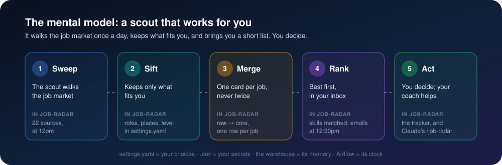

<p align="center">
  
</p>

# 👣 job-radar, in baby steps

New to job-radar? Start here. First the picture to keep in your head, then every step from an
empty laptop to your first application, one small step at a time. The [README](README.md) is the
reference; this is the walk-through.

## 🧠 The mental model

Think of job-radar as **a scout that works for you**. Five stations, always in this order:

| # | Station | Picture it as | What does it in job-radar |
|---|---|---|---|
| 1 | 🔵 **Sweep** | The scout walks the whole job market | Airflow runs the *collect* at 11am and 7pm: 12 sources, from Wuzzuf and Indeed to 200+ company career pages and your Gmail alerts |
| 2 | 🟢 **Sift** | It keeps only what fits you | your rules in `settings.yaml`: roles, places, level; onsite only in Cairo or Giza, remote anywhere else |
| 3 | 🟠 **Merge** | One card per job, never twice | the warehouse: every posting lands in `raw`, each job becomes one row in `core`, even when three boards carry it |
| 4 | 🟣 **Rank** | The best first, delivered to your inbox | your skills are matched; two emails at 11:30am and 7:30pm, junior to senior, your companies first |
| 5 | ✅ **Act** | You decide; your coach helps | the tracker to mark what you apply to, and Claude's `/job-radar` to review, tailor and apply |

And four things to remember about where things live:

- **`settings.yaml` is your choices.** Change a role, a place or a company there; nowhere else.
- **`.env` is your secrets.** Passwords stay on your laptop and never go to GitHub.
- **The warehouse is its memory.** It remembers every job it has seen, so nothing comes twice.
- **Airflow is its clock.** It wakes the scout on time, even if you forget.

## 🧰 Before you start

You need:

- [ ] A Windows, Mac or Linux laptop that is on at 11am or 7pm most days (a missed time runs
      as soon as the laptop wakes)
- [ ] [Docker Desktop](https://www.docker.com/products/docker-desktop/)
- [ ] A Gmail account with 2-Step Verification turned on
- [ ] About 30 minutes for the first setup

## 🚀 First-time setup

### Step 1 · Install Docker Desktop

1. Download and install [Docker Desktop](https://www.docker.com/products/docker-desktop/).
2. Open it once and let it finish starting (the whale icon stops moving).
3. In its settings, turn on **Start Docker Desktop when you sign in**: job-radar runs only while
   Docker runs.

### Step 2 · Get the code

```bash
git clone https://github.com/omarshalabyy1/job-radar.git
cd job-radar
```

### Step 3 · Make a Gmail app password

job-radar sends your emails and reads your job alerts with an *app password*, never your real
password.

1. Open https://myaccount.google.com/apppasswords (sign in if asked).
2. Type a name such as `job-radar` and press **Create**.
3. Copy the 16-letter code it shows. You will paste it in the next step; you can't see it again.

> Want job-radar to read alerts from more inboxes? Make an app password in each of them too.

### Step 4 · Fill in your `.env`

```bash
cp .env.example .env
```

Open `.env` in any text editor and fill in:

| Line | Put | Example |
|---|---|---|
| `WAREHOUSE_PASSWORD` | any password you choose (letters and digits) | `radar2026pass` |
| `GMAIL_USER` | the Gmail that sends the emails | `you@gmail.com` |
| `GMAIL_APP_PASSWORD` | the 16-letter code from step 3 | `abcdefghijklmnop` |
| `MAIL_TO` | where the emails go; empty means `GMAIL_USER` | |
| `MAILBOXES` | the inboxes to read job alerts from, as `address:app-password`, comma-separated | `you@gmail.com:abcdefghijklmnop` |
| `JOOBLE_API_KEY` | optional; leave empty | |

Save the file. It is listed in `.gitignore`, so it never leaves your laptop.

### Step 5 · Start job-radar

```bash
docker compose up -d --build
```

The first time takes 10 to 20 minutes (it builds the image and downloads a browser). Then check
that three containers are up:

```bash
docker ps --format "{{.Names}}  {{.Status}}"
```

You should see `job-radar-warehouse-1`, `job-radar-airflow-1` and `job-radar-tracker-1`, all `Up`.

### Step 6 · Run your first collect

1. Open Airflow at http://127.0.0.1:8081 (no login).
2. You see three DAGs: `job_radar` (the collect) and the two email ones.
3. Click `job_radar`, then **Trigger** (top right).
4. Wait 3 to 5 minutes. Every task box turns green; click a box and **Logs** to read what each
   source found ("freehire: 175 postings, 91 new").

### Step 7 · Open your tracker and add your CV

1. Open the tracker at http://127.0.0.1:8501. The **Jobs** tab lists everything the collect kept.
2. Go to the **CV** tab and upload your CV as a PDF. From now on every job shows how much of what
   it asks for your CV covers, and Claude can tailor applications from it.

### Step 8 · Get your first email

Wait for 11:30am or 7:30pm (Cairo time), or send it now: in Airflow, **Trigger**
`job_radar_email_egypt` and `job_radar_email_abroad`. Each job is emailed once, so the next email
brings only new ones.

### Step 9 · Turn on job alerts

Job alerts are how LinkedIn's jobs reach job-radar (it never visits LinkedIn itself). On LinkedIn,
Wuzzuf, Indeed and Wellfound, create alerts for your roles and send them to an inbox listed in
`MAILBOXES`. job-radar reads every email there, spam included, and takes only the job links.

### Step 10 · Make it yours

Open [`settings.yaml`](settings.yaml). Everything is plain words; save, and the next run uses it.

- **Your roles**, in the order you want them, under `roles`.
- **Your places** under `places`; onsite areas in Egypt under `onsite_areas`.
- **Your companies** under `companies`: a name, and a careers link if you have one. Jobs at
  companies in `your_companies` get a ⭐ and come first.
- **The times** under `schedule`, like `11am` or `"7:30pm"`.

> Broke something? Airflow shows an error at the top of its page naming the line: lists go in
> `[...]`, and every `:` needs a space after it.

## ☀️ Your daily routine

1. **Open the email** at 11:30am or 7:30pm. Junior jobs first, senior last; ⭐ are your companies.
2. **Tap a job** to read it on its own site.
3. **Mark it in the tracker**: *saved*, *applied*, *interview*, *offer*, *rejected* or *ignored*.
   Ignored jobs drop out of Claude's review and the career-ops export.
4. **Ask Claude** when you want help (next section).

## 🤖 Working with Claude

In Claude Code, type:

| You type | What happens |
|---|---|
| `/job-radar` | runs a collect now, then grades your best 15 new matches A to F against your CV |
| `/job-radar review` | the same review, without a collect |
| `/job-radar apply <job>` | a tailored CV, a cover letter and interview notes for that job, then help with the form |
| `/job-radar emails` | sends both emails now |

What to expect, step by step:

1. Claude shows a table: grade, job, why, link. **A** apply now, **B** good with gaps,
   **C** a stretch, **D/F** skip.
2. You pick the jobs you like.
3. For each, Claude writes `cv.md`, `cover-letter.md` and `notes.md` in
   `output/applications/<date>/<company>-<title>/`, using only what is true in your CV.
4. To apply, Claude shows you exactly what will be sent and waits for your **yes**, one job at a
   time. Logins, passwords and CAPTCHAs are yours. LinkedIn and Indeed applications stay manual:
   their terms ban automation.

## 🩺 When something looks wrong

| You notice | Do |
|---|---|
| No email came | Airflow → the email DAG → last run → **Logs**. "no new jobs, nothing sent" is normal. |
| A task is red | Click it → **Logs**. Network hiccups fix themselves on the next run. |
| Airflow or the tracker won't open | Is Docker Desktop running? Then `docker compose up -d`. |
| Everything is slow | Another Docker stack may be using every CPU; stop it, or restart Docker Desktop. |
| A site seems skipped | It asked job-radar to wait (a file in `output/waits/`); it comes back by itself. |
| A company shows *blocked* | Its site shows a bot check: run `.venv\Scripts\python scripts\open_blocked.py`, get past the check in the window, press Enter. Its session is saved for the next runs. |

More in the README's [Troubleshooting](README.md).

## 📖 Words you will see

| Word | Means |
|---|---|
| **Collect** | one run of the scout over all sources (`job_radar` in Airflow) |
| **DAG** / **task** | Airflow's name for a scheduled job / one step of it |
| **raw → core → mart** | the warehouse's three floors: every posting as found; one row per job; the views the email and tracker read |
| **In scope** | a job that passed your rules (role, place, level) |
| **Hold** | a site asked job-radar to wait (429), so it waits; see `output/waits/` |
| **Starred** ⭐ | a job at one of your companies |
| **Digest** | one of the two emails |

<p align="center">
  
</p>
