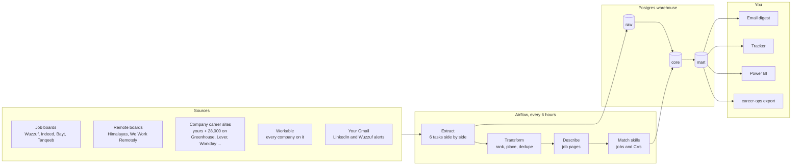
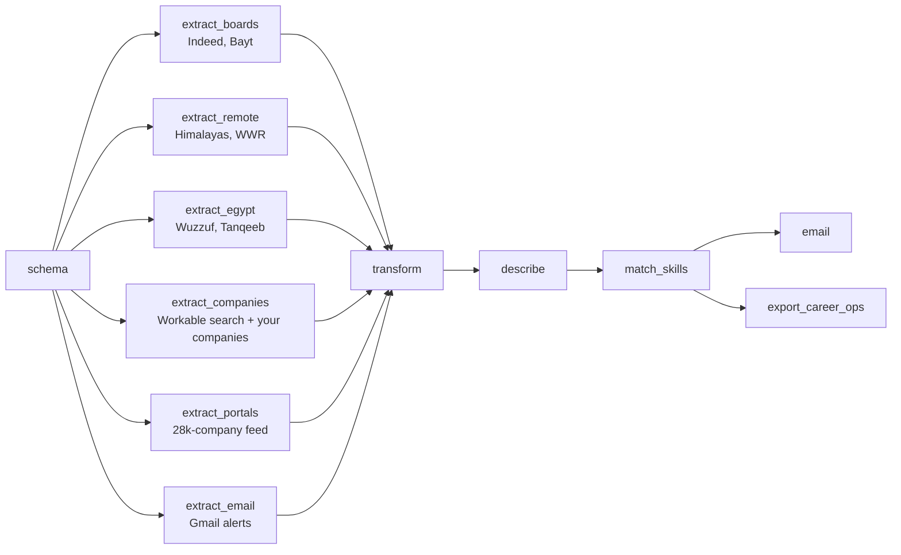
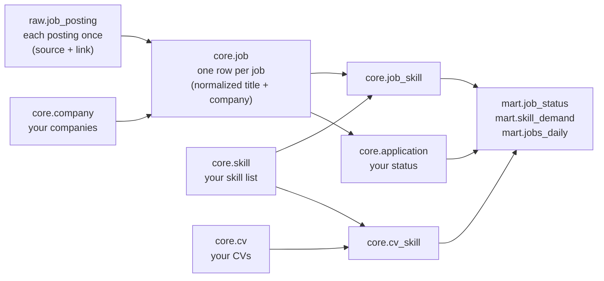

# job-radar

Every 6 hours, job-radar collects the new data and AI jobs in Egypt, the Gulf and remote from job
boards, company career sites and your own inbox's job alerts. It ranks them by how many of your
skills they ask for, stores them in a Postgres warehouse, and emails you only the ones you have not
seen. It runs on your laptop with Docker and Airflow, and costs nothing.

## The mental model

Four layers, one direction: **sources → the run → the warehouse → you**.

### One run

- Runs at 01:00, 07:00, 13:00 and 19:00 Cairo time. A run missed while the laptop was asleep or
  off runs once as soon as it is back, Trigger in Airflow runs it now, and every run backfills
  the last 24 hours.
- Runs never overlap. A run takes about as long as its slowest source, because the six extract
  tasks run in parallel and each one reads its sites in parallel too.

### The warehouse

**No duplicates, ever.** A posting is stored once (its source and link). A job is one row: the
same normalized title and company, so "Data Engineer - Cairo (Hybrid)" at "Acme Ltd." on one board
and "Data Engineer" at "ACME" on another, or the same job reposted next week, are one job. Each job
is emailed once. Two runs back to back add nothing the second time.

## What counts as a job for you

| | |
|---|---|
| **Roles**, best fit first | 1 AI & Data Engineer · 2 Data Engineer · 3 AI Engineer (NLP, LLM, agents, RAG) · 4 BI Developer (Power BI, Excel) · 5 Data Analyst, with their title variants in English and Arabic |
| **Places** | Egypt, UAE, Saudi Arabia, Qatar, and remote jobs open to someone in Egypt |
| **Level** | entry and mid. Senior, lead, manager and architect titles are left out; jobs that state no years of experience are kept |
| **Left out** | data entry, MLOps, DevOps, SRE, QA, technician, teaching, recruiting, accounting |
| **⭐ Your companies** | starred and listed first from any source: your list plus the companies in the same sectors (telecom, Big 4 and consulting, banking, logistics, FMCG, real estate, IT services, fintech). Add more in the tracker |
| **Ranking** | role order, then ⭐, then how many of your skills the job asks for; with a CV uploaded, how much of that your CV covers |

## Sources

| Source | How |
|---|---|
| Wuzzuf | the JSON API its own web app calls: every job in Egypt posted in the window, with its full description |
| Indeed, Bayt | [JobSpy](https://github.com/speedyapply/JobSpy), as a guest |
| Bayt, Forasna, NaukriGulf, GulfTalent | [Tanqeeb](https://egypt.tanqeeb.com), which gathers them: its IT, data analyst, business analyst, Python and internship pages, newest first |
| Every company on Workable (startups and small and mid companies above all) | Workable's public job search |
| LinkedIn | your LinkedIn job-alert emails only: nothing ever contacts LinkedIn |
| Himalayas, We Work Remotely | public search API, RSS feed |
| Your companies (tracker, Companies tab) | detected once, then read every run: Workable, Greenhouse, Lever, Ashby, Phenom (Orange, DHL), SuccessFactors (Nestlé, EY), RSS (Deloitte), or any other careers page rendered with Playwright |
| 28,000+ company career pages on Greenhouse, Lever, Ashby, Workday, BambooHR, iCIMS, Paylocity | the daily crawl of [job-board-aggregator](https://github.com/Feashliaa/job-board-aggregator) |
| Your Gmail inboxes | read-only IMAP on your laptop: the job links in job-alert emails |

**Never done:** logging in to a job site, or getting past a bot check (a Cloudflare challenge, a
CAPTCHA). A site that cannot be read shows why in the Companies tab and is tried again a day later;
its jobs still reach you through the boards and your alerts. Reading careers pages whose
robots.txt asks crawlers to stay away is your choice (`RESPECT_ROBOTS` in `job_radar/config.py`).

## What you see

- **Email**, after each run with new jobs: the run's numbers, one section per role, one card per
  job with ⭐, place, source, date, your matched skills and your CV's coverage.
- **Tracker**, http://127.0.0.1:8501: filter jobs and set saved / applied / interview / offer /
  rejected; skills in demand per role; your companies (add a name and its careers page); your CVs
  (upload a PDF).
- **Airflow**, http://127.0.0.1:8081: the runs, each task's log, and Trigger.
- **Power BI**: PostgreSQL `localhost:5433`, database and user `jobradar`, the `mart` views.
- **career-ops export**: `output/career-ops/pipeline.md` (the run's best matches) and `cv.md` (your
  newest CV), to copy into [career-ops](https://github.com/career-ops-hq/career-ops) and tailor your
  CV in Claude Code.

## Set up

1. `cp .env.example .env` and fill it in: the warehouse password, a Gmail app password for the
   email, your inboxes (`MAILBOXES`, one Gmail app password each), and optionally a free Jooble key.
   Gmail app passwords: turn on 2-Step Verification, then https://myaccount.google.com/apppasswords.
2. Turn on job alerts for your roles on LinkedIn and Wuzzuf, sent to those inboxes.
3. `docker compose up -d --build`, then open the tracker to upload your CV and add companies.
4. Keep Docker Desktop open (or set it to start when you sign in): the runs happen while it runs.

To change the roles, places, keywords or left-out titles, edit `job_radar/config.py`; your skill
list is `core.skill` in `sql/schema.sql`.

## Recommended GitHub projects

From a search of 868 job-hunting repos (stars, last push, license, archived checked on 2026-10-02).
**Used by job-radar:** JobSpy (a library), job-board-aggregator (its data), career-ops (the export),
and the design of wuzzuf-etl-pipeline.

### AI job agents that run inside your coding tool

| Repo | ★ | What it does |
|---|---|---|
| [career-ops-hq/career-ops](https://github.com/career-ops-hq/career-ops) | 73.3k | Scans job boards, scores each job against your CV, tailors an ATS-friendly CV, tracks applications |
| [MadsLorentzen/ai-job-search](https://github.com/MadsLorentzen/ai-job-search) | 44.8k | Claude Code framework: rates postings, tailors CVs, writes cover letters |
| [pinloop-ai/pinloop-cli](https://github.com/pinloop-ai/pinloop-cli) | 546 | Job-board command-line tool for coding agents, refreshed hourly |
| [vaibhavarora14/job-application-agent](https://github.com/vaibhavarora14/job-application-agent) | 154 | Agent skill that asks you to confirm every submission |

### Auto-apply bots

| Repo | ★ | What it does |
|---|---|---|
| [GodsScion/Auto_job_applier_linkedIn](https://github.com/GodsScion/Auto_job_applier_linkedIn) | 2.9k | LinkedIn Easy Apply with Selenium, optional AI answers |
| [Pickle-Pixel/ApplyPilot](https://github.com/Pickle-Pixel/ApplyPilot) | 1.7k | AI agent for any site and form; AGPL |
| [nicolomantini/LinkedIn-Easy-Apply-Bot](https://github.com/nicolomantini/LinkedIn-Easy-Apply-Bot) | 1.2k | LinkedIn Easy Apply |
| [wodsuz/EasyApplyJobsBot](https://github.com/wodsuz/EasyApplyJobsBot) | 829 | LinkedIn and Glassdoor Easy Apply |
| [lookr-fyi/job-application-bot-by-ollama-ai](https://github.com/lookr-fyi/job-application-bot-by-ollama-ai) | 471 | Local Ollama model; no license |
| [beatwad/LinkedIn-AI-Job-Applier-Ultimate](https://github.com/beatwad/LinkedIn-AI-Job-Applier-Ultimate) | 170 | Playwright, LinkedIn and Indeed, Telegram reports |
| [kaymen99/Upwork-AI-jobs-applier](https://github.com/kaymen99/Upwork-AI-jobs-applier) | 166 | Upwork proposals |

Auto-applying on LinkedIn and Indeed breaks their terms of service, and accounts get banned for it.

### Job search: scraping and aggregators

| Repo | ★ | What it does |
|---|---|---|
| [speedyapply/JobSpy](https://github.com/speedyapply/JobSpy) | 4.4k | Python library for LinkedIn, Indeed, Glassdoor, ZipRecruiter and Google Jobs |
| [rainmanjam/jobspy-api](https://github.com/rainmanjam/jobspy-api) · [borgius/jobspy-mcp-server](https://github.com/borgius/jobspy-mcp-server) | 380 · 116 | JobSpy as a Docker web API and as an MCP server |
| [strelov1/freehire](https://github.com/strelov1/freehire) | 799 | Open-source job search engine (Go) |
| [spinlud/py-linkedin-jobs-scraper](https://github.com/spinlud/py-linkedin-jobs-scraper) | 497 | LinkedIn job scraper |
| [Feashliaa/job-board-aggregator](https://github.com/Feashliaa/job-board-aggregator) | 161 | 1M+ jobs from Greenhouse, Lever, Ashby and Workday |

### Scheduled monitoring and tracking

| Repo | ★ | What it does |
|---|---|---|
| [DaKheera47/job-ops](https://github.com/DaKheera47/job-ops) | 4.0k | Self-hosted pipeline to track, analyze and assist your applications |
| [Gsync/jobsync](https://github.com/Gsync/jobsync) | 1.4k | Self-hosted tracker with resume review and job matching |
| [tarunlnmiit/autopilot-jobhunt](https://github.com/tarunlnmiit/autopilot-jobhunt) | 212 | Scans 130+ careers pages nightly, scores each job, alerts on Telegram |
| [colophon-group/jobseek](https://github.com/colophon-group/jobseek) | 201 | Watches company careers pages for new postings |
| [JustAJobApp/jobseeker-analytics](https://github.com/JustAJobApp/jobseeker-analytics) | 202 | Reads your Gmail and builds an application dashboard |
| [ahmed-mo505/wuzzuf-etl-pipeline](https://github.com/ahmed-mo505/wuzzuf-etl-pipeline) | | Wuzzuf every 6 hours into Postgres with Airflow, an email, and Power BI |

**Resume tailoring:** [Resume-Matcher](https://github.com/srbhr/Resume-Matcher) 28.6k ·
[reactive-resume](https://github.com/reactive-resume/reactive-resume) 43.7k.
**Stale:** JobFunnel is archived; AIHawk (31.7k) now redirects to an unrelated browser tool.

## Credits

[JobSpy](https://github.com/speedyapply/JobSpy) (MIT) for the Indeed and Bayt searches.
[job-board-aggregator](https://github.com/Feashliaa/job-board-aggregator) by Riley Dorrington for
the company career pages; its data is [CC BY-NC 4.0](https://creativecommons.org/licenses/by-nc/4.0/),
so this project stays non-commercial. Ideas from career-ops, autopilot-jobhunt, jobsync and
wuzzuf-etl-pipeline, rewritten here.
