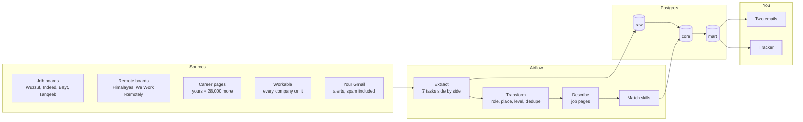

<div align="center">

# job-radar

**Your own job search, on autopilot.** Four times a day it collects the new data and AI jobs from
job boards, company career pages and your own job-alert emails, keeps only the ones that fit you,
and emails them in two clean digests: one for home, one for remote jobs everywhere else.


Runs on your laptop · costs nothing · never logs in anywhere · no duplicates, ever

</div>

---

## What you get

<table>
<tr>
<td width="45%" valign="top"></td>
<td valign="top">

**Two emails, each with only the jobs you have not seen**

| Email | When (Cairo time) | What is in it |
|---|---|---|
| Home (Egypt) | 12pm and 7pm | onsite and hybrid jobs in Cairo or Giza, and Egypt's remote jobs |
| Outside Egypt | 8am and 8pm | remote jobs in the Gulf, Europe, the USA and worldwide |

Inside each email, the further you scroll the more experience a job asks for:
**Entry & junior → Mid level → Senior**, then your roles in your order, then full-time,
part-time, contract and freelance. Jobs at your companies are marked ⭐ and come first.

**Also on your laptop**

- **Tracker** at http://127.0.0.1:8501: filter jobs, mark saved / applied / interview / offer,
  see the skills each role asks for, upload your CV, add companies.
- **Airflow** at http://127.0.0.1:8081: every run, every task's log, and *Trigger* to run now.
- **SQL** at `localhost:5433` (database and user `jobradar`): query the `mart` views.
- **career-ops export** in `output/career-ops/`: the best matches and your CV, ready for
  [career-ops](https://github.com/career-ops-hq/career-ops).

</td>
</tr>
</table>

## Quick start

You need [Docker Desktop](https://www.docker.com/products/docker-desktop/) and a Gmail account.

```bash
git clone https://github.com/omarshalabyy1/job-radar.git && cd job-radar
cp .env.example .env          # then fill it in (below)
docker compose up -d --build  # Airflow, the warehouse and the tracker
```

Fill in `.env` (it never leaves your laptop):

| Setting | What to put |
|---|---|
| `WAREHOUSE_PASSWORD` | any password you choose, letters and digits |
| `GMAIL_USER`, `GMAIL_APP_PASSWORD` | the Gmail that sends the emails, and its [app password](https://myaccount.google.com/apppasswords) (2-Step Verification on) |
| `MAIL_TO` | where the emails go (empty: `GMAIL_USER`) |
| `MAILBOXES` | the inboxes to read job alerts from: `you@gmail.com:apppassword,other@gmail.com:apppassword` |
| `JOOBLE_API_KEY` | optional, a free key from [Jooble](https://jooble.org/api/about) |

Then turn on LinkedIn and Wuzzuf job alerts for your roles, sent to those inboxes, and keep Docker
Desktop running. The first emails arrive at the next email time; *Trigger* in Airflow runs a
collection now.

> After editing `.env`, run `docker compose up -d` so the containers pick it up.

## Make it yours: `settings.yaml`

Everything you would want to change is plain words in [`settings.yaml`](settings.yaml). Edit, save,
and the next run uses it. A schedule change shows in Airflow within a minute.

| Section | What it changes |
|---|---|
| `home` | your home country: onsite and hybrid jobs are kept only here, and it gets its own email |
| `schedule` | when it collects and when each email goes, written `8am`, `12pm`, `7pm` |
| `roles` | the jobs you want, **in your order** (the email follows it): the words a title needs, and what the job boards are searched for |
| `search_words` | the plain search words for Himalayas, Workable and Jooble |
| `too_senior`, `never` | titles to leave out: above your level, or never yours |
| `experience` | the words for entry and senior, and the years that make a job entry (1 or less) or senior (5 or more) |
| `places` | the places, **in email order**, where the boards search, and the words that name each one |
| `onsite_areas`, `other_home_cities` | where at home an onsite job is fine (Cairo, Giza ...), and the cities that are not |
| `remote_words` | how a remote job says so |
| `your_companies` | companies whose jobs get ⭐ and go first |
| `companies` | career pages read every run: a name and a link |

How words match a title, a location or a company:

```yaml
roles:
  - name: Data Engineer
    search: [Data Engineer, ETL Developer, Analytics Engineer]
    title_needs:                      # one word from EACH list
      - [data engineer*, etl, analytics engineer*]

too_senior: [lead, principal, head, director, manager]   # whole words, any case
```

- A word matches as a whole word, in any case: `ai` matches "AI Engineer", not "Airline".
- A trailing `*` matches the start of a word: `engineer*` matches engineer, engineers, engineering.
- English and Arabic both work: `مهندس بيانات*`.

Secrets stay in `.env`. Your skill list (what the tracker counts) is `core.skill` in
[`sql/schema.sql`](sql/schema.sql).

## How it works



Three Airflow DAGs share the work:

| DAG | When | Does |
|---|---|---|
| `job_radar` | 1am, 7am, 11am, 6pm | extract → transform → describe → match_skills → export_career_ops |
| `job_radar_email_egypt` | 12pm, 7pm | emails home's new jobs |
| `job_radar_email_abroad` | 8am, 8pm | emails everywhere else's new jobs |

**The rules that decide what reaches you**

- **Roles:** a title must fit one of your roles; titles above your level or never yours are left out.
- **Places:** onsite or hybrid only at home, in your onsite areas; anywhere else the job must be
  remote. The place comes from the search, else the location, else the title; a job alert whose
  place cannot be told goes under *Unknown location*.
- **No duplicates:** a posting is stored once (source + link); a job is one row (its normalized
  title + company), so the same job on three boards, or reposted, is one job; each job is emailed once.
- **Fast:** a run finishes in under 5 minutes; each step stops at its time budget and leaves the
  rest for the next run. A run missed while the laptop slept runs once it wakes.

**Never done:** logging in to a job site, or getting past a bot check. LinkedIn is only read
through your own alert emails. A careers page that cannot be read shows why in the tracker and is
tried again a day later.

## Sources

| Source | How |
|---|---|
| Wuzzuf | the JSON API its web app calls: every job in Egypt in the window, with its description |
| Indeed, Bayt | [JobSpy](https://github.com/speedyapply/JobSpy) as a guest; remote jobs only outside home |
| Tanqeeb (Bayt, Forasna, NaukriGulf, GulfTalent) | its Egypt site's IT, data, business analyst, Python and internship pages |
| Workable | its public job search, every company on it; remote only outside home |
| Himalayas, We Work Remotely | public search API, RSS feed |
| Your companies | each career page detected once (Workable, Greenhouse, Lever, Ashby, Phenom, SuccessFactors, RSS, or rendered with Playwright), then read every run |
| 28,000+ career pages | the daily crawl of [job-board-aggregator](https://github.com/Feashliaa/job-board-aggregator) |
| Your Gmail | read-only IMAP, inbox and spam: the job links in job-alert emails (any LinkedIn email, Indeed, Wuzzuf, Bayt ...) |

## Troubleshooting

| You see | Do |
|---|---|
| No email arrived | Airflow → the email DAG's last run → its log. "no new jobs, nothing sent" is normal between collections. |
| A `.env` change does nothing | `docker compose up -d` (the containers read `.env` when they are created). |
| A `settings.yaml` change broke the runs | Airflow shows an import error at the top; fix the line it names (YAML: lists in `[...]`, a space after `:`). |
| Docker is slow or stuck | `wsl --shutdown`, then restart Docker Desktop. |

## Credits

[JobSpy](https://github.com/speedyapply/JobSpy) (MIT) for the Indeed and Bayt searches;
[job-board-aggregator](https://github.com/Feashliaa/job-board-aggregator) by Riley Dorrington for
the career pages, whose data is [CC BY-NC 4.0](https://creativecommons.org/licenses/by-nc/4.0/),
so this project stays non-commercial.

## Recommended GitHub projects

From a search of 868 job-hunting repos (stars, last push, license, archived checked on 2026-10-02).
**Used by job-radar:** JobSpy (a library), job-board-aggregator (its data), career-ops (the export),
and the design of wuzzuf-etl-pipeline.

### AI job agents that run inside your coding tool

| Repo | ★ | What it does |
|---|---|---|
| [career-ops-hq/career-ops](https://github.com/career-ops-hq/career-ops) | 73.3k | Scans job boards, scores each job against your CV, tailors an ATS-friendly CV, tracks applications |
| [MadsLorentzen/ai-job-search](https://github.com/MadsLorentzen/ai-job-search) | 44.8k | Claude Code framework: rates postings, tailors CVs, writes cover letters |
| [pinloop-ai/pinloop-cli](https://github.com/pinloop-ai/pinloop-cli) | 546 | Job-board command-line tool for coding agents, refreshed hourly |
| [vaibhavarora14/job-application-agent](https://github.com/vaibhavarora14/job-application-agent) | 154 | Agent skill that asks you to confirm every submission |

### Auto-apply bots

| Repo | ★ | What it does |
|---|---|---|
| [GodsScion/Auto_job_applier_linkedIn](https://github.com/GodsScion/Auto_job_applier_linkedIn) | 2.9k | LinkedIn Easy Apply with Selenium, optional AI answers |
| [Pickle-Pixel/ApplyPilot](https://github.com/Pickle-Pixel/ApplyPilot) | 1.7k | AI agent for any site and form; AGPL |
| [nicolomantini/LinkedIn-Easy-Apply-Bot](https://github.com/nicolomantini/LinkedIn-Easy-Apply-Bot) | 1.2k | LinkedIn Easy Apply |
| [wodsuz/EasyApplyJobsBot](https://github.com/wodsuz/EasyApplyJobsBot) | 829 | LinkedIn and Glassdoor Easy Apply |
| [lookr-fyi/job-application-bot-by-ollama-ai](https://github.com/lookr-fyi/job-application-bot-by-ollama-ai) | 471 | Local Ollama model; no license |
| [beatwad/LinkedIn-AI-Job-Applier-Ultimate](https://github.com/beatwad/LinkedIn-AI-Job-Applier-Ultimate) | 170 | Playwright, LinkedIn and Indeed, Telegram reports |
| [kaymen99/Upwork-AI-jobs-applier](https://github.com/kaymen99/Upwork-AI-jobs-applier) | 166 | Upwork proposals |

Auto-applying on LinkedIn and Indeed breaks their terms of service, and accounts get banned for it.

### Job search: scraping and aggregators

| Repo | ★ | What it does |
|---|---|---|
| [speedyapply/JobSpy](https://github.com/speedyapply/JobSpy) | 4.4k | Python library for LinkedIn, Indeed, Glassdoor, ZipRecruiter and Google Jobs |
| [rainmanjam/jobspy-api](https://github.com/rainmanjam/jobspy-api) · [borgius/jobspy-mcp-server](https://github.com/borgius/jobspy-mcp-server) | 380 · 116 | JobSpy as a Docker web API and as an MCP server |
| [strelov1/freehire](https://github.com/strelov1/freehire) | 799 | Open-source job search engine (Go) |
| [spinlud/py-linkedin-jobs-scraper](https://github.com/spinlud/py-linkedin-jobs-scraper) | 497 | LinkedIn job scraper |
| [Feashliaa/job-board-aggregator](https://github.com/Feashliaa/job-board-aggregator) | 161 | 1M+ jobs from Greenhouse, Lever, Ashby and Workday |

### Scheduled monitoring and tracking

| Repo | ★ | What it does |
|---|---|---|
| [DaKheera47/job-ops](https://github.com/DaKheera47/job-ops) | 4.0k | Self-hosted pipeline to track, analyze and assist your applications |
| [Gsync/jobsync](https://github.com/Gsync/jobsync) | 1.4k | Self-hosted tracker with resume review and job matching |
| [tarunlnmiit/autopilot-jobhunt](https://github.com/tarunlnmiit/autopilot-jobhunt) | 212 | Scans 130+ careers pages nightly, scores each job, alerts on Telegram |
| [colophon-group/jobseek](https://github.com/colophon-group/jobseek) | 201 | Watches company careers pages for new postings |
| [JustAJobApp/jobseeker-analytics](https://github.com/JustAJobApp/jobseeker-analytics) | 202 | Reads your Gmail and builds an application dashboard |
| [ahmed-mo505/wuzzuf-etl-pipeline](https://github.com/ahmed-mo505/wuzzuf-etl-pipeline) | | Wuzzuf every 6 hours into Postgres with Airflow, an email, and Power BI |

### Resume tailoring

| Repo | ★ | What it does |
|---|---|---|
| [srbhr/Resume-Matcher](https://github.com/srbhr/Resume-Matcher) | 28.6k | Compares your resume with a job description and suggests the keywords to add |
| [reactive-resume/reactive-resume](https://github.com/reactive-resume/reactive-resume) | 43.7k | Free, open-source resume builder |

**Stale:** JobFunnel is archived; AIHawk (31.7k) now redirects to an unrelated browser tool.
