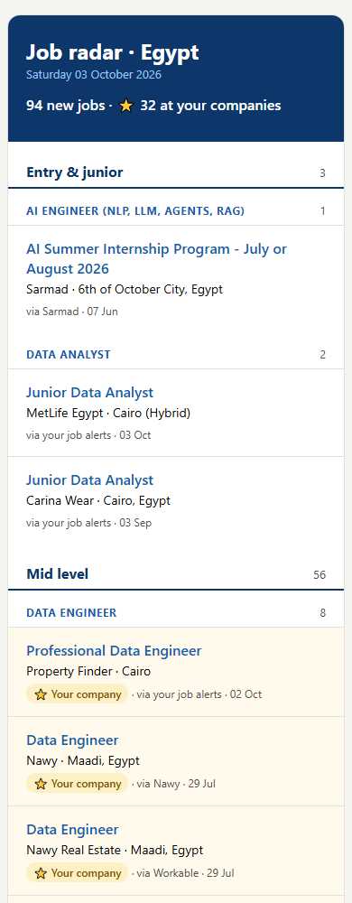
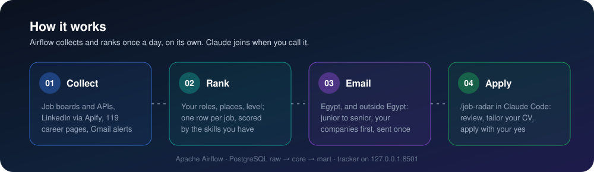

<p align="center">
  
</p>

<p align="center">
  
</p>

<p align="center">
  
  
  
  
  
  
</p>

<h3 align="center">Your own job search, on autopilot: every new data and AI job from 12 sources,<br>ranked by your skills, in two emails a day.</h3>

<p align="center">
  
  
  
  
  
</p>

<p align="center">
  <a href="GUIDE.md"></a>
</p>

## 📬 What you get



**Two emails, each with only the jobs you have not seen**

- 🏠 **Egypt** · 11:30am and 7:30pm (Cairo time): onsite and hybrid jobs in Cairo or Giza, and
  Egypt's remote jobs
- 🌍 **Outside Egypt** · 11:30am and 7:30pm: remote jobs in the Gulf, Europe, the USA and worldwide

The further you scroll, the more experience a job asks for: **Entry & junior → Mid level →
Senior**, best match first in each; your roles in your order; full-time, part-time, contract and
freelance. Jobs at your companies get a ⭐.

**Also on your laptop**

- 📋 **Tracker**, http://127.0.0.1:8501: filter jobs, mark saved / applied / interview / offer,
  see the skills each role asks for, upload your CV, see how each company's careers page is read.
- 🌀 **Airflow**, http://127.0.0.1:8081: every run, every task's log, and *Trigger* to run now.
- 🤖 **Claude**, `/job-radar` in Claude Code: reviews your matches, tailors your CV, helps you apply.
- 🗄️ **SQL**, `localhost:5433` (database and user `jobradar`): query the `mart` views.

<br clear="right">

## 🧭 How it works

<p align="center">
  
</p>

<details>
<summary><b>📐 The rules that decide what reaches you</b></summary>
<br>

- **Roles:** a title must fit one of your roles; titles above your level or never yours are left out.
  A LinkedIn alert's jobs are all kept (LinkedIn chose them for your alert), after your roles.
- **Places:** onsite or hybrid only in Egypt, in your onsite areas (Cairo, Giza ...); anywhere else
  the job must be remote: hybrid, onsite and "not remote" never count as remote. The place comes
  from the search, else the location, else the title; a job alert whose place cannot be told
  stays only when it says remote.
- **No duplicates:** a posting is stored once (source + link); a job is one row (its normalized
  title + company), so the same job on three boards, or reposted, is one job; each job is emailed once.
- **Fast:** a collect finishes in under 5 minutes; each step stops at its time budget and leaves the
  rest for the next run. A collect missed while the laptop slept runs once it wakes.
- **Every public page is read**, whatever a site's robots.txt says; a site that turns scripts away
  is asked again with a real Chrome's handshake. The code never logs in and never gets past a bot
  check: a site that shows one is opened by you once (`scripts/open_blocked.py`) and read with your
  saved session after that. LinkedIn is never opened: its jobs come only from your alert emails. A
  careers page that cannot be read shows why in the tracker and is tried again a day later.

</details>

## 🗓️ A day with job-radar

<p align="center">
  
</p>

| Airflow DAG | When | Does |
|---|---|---|
| `job_radar` | 11am, 7pm | extract (9 tasks side by side) → transform → describe → match_skills → export_career_ops |
| `job_radar_email_egypt` | 11:30am, 7:30pm | emails Egypt's new jobs |
| `job_radar_email_abroad` | 11:30am, 7:30pm | emails everywhere else's new jobs |

No AI runs on this schedule. Airflow keeps its own records in the warehouse's Postgres, and when
one of its parts stops, Docker restarts it.

## 🤖 Claude, when you call it

Type `/job-radar` in Claude Code: it runs a collect, then reads your matches the way a recruiter
would, against your CV.

| You type | Claude |
|---|---|
| `/job-radar` | starts a collect and reports each task, grades the best 15 new matches A to F with the gaps, tailors what you pick |
| `/job-radar review` | the same, without a collect |
| `/job-radar apply <job>` | writes a CV, a cover letter and interview notes for that job, then fills its application form once you say yes |
| `/job-radar emails` | sends both emails now |

Everything lands in `output/applications/<date>/<company>-<title>/` and the job shows as *saved*
in the tracker. Nothing is ever sent without your yes, logins stay yours, and nothing applies
through LinkedIn or Indeed: their terms ban automation, and accounts get banned for it.

## 📡 Sources

<p align="center">
  
  
  
  
  
  
  
  
  
  
  
  
  
  
  
  
  
  
  
  
  
  
</p>

Every source stays inside its limits, so none has a reason to block your internet address. One
request a second at most to any site (Workable's search, limited by the day instead, a little
faster). A site that answers 429 Too Many Requests is left alone for as long as it asks, and one
that still answers 403 to a real Chrome's handshake for 6 hours, by every step and run (one file
per site in `output/waits/`; delete it to lift the hold early).

| Source | How | Within its limits |
|---|---|---|
| Wuzzuf | the JSON API its web app calls: every job in Egypt from the last 24 hours, newest first, with its description | a few calls a run, 1 second apart |
| Indeed, Bayt | [JobSpy](https://github.com/speedyapply/JobSpy) as a guest; remote jobs only outside Egypt | 3 seconds between a board's searches; a 403 or 429 stops that board for 6 hours |
| Tanqeeb (Bayt, Forasna, NaukriGulf, GulfTalent) | its Egypt, UAE, Saudi, Qatar, Kuwait, Bahrain and Oman sites' IT, data, business analyst, Python and internship pages; outside Egypt only jobs that say remote | 5 pages a site a run, 1 second apart |
| NaukriGulf, GulfTalent | the search APIs their pages call (they answer only a real Chrome handshake): the newest jobs of each keyword from the last week; outside Egypt only remote ones are kept | 13 searches each a run, 1 second apart, in the Gulf task |
| Dubizzle Jobs (UAE) | the public search index its pages query (the pages sit behind a bot check): remote jobs of the last week | one call a run |
| Workable | its public job search, every company on it; remote only outside Egypt | one round a day: it allows few searches a day, and each covers the whole day |
| Himalayas, We Work Remotely | public search API, RSS feed | 1 second between pages |
| Remotive, Remote OK, Jobicy, Working Nomads, Arbeitnow | public APIs, no key: each board's newest remote jobs from the last week (several publish a day or more late) | one call each a run; Remotive held 6 hours after each (it asks for at most 4 a day) |
| DailyRemote | its newest remote jobs in your fields (the company is behind its paid plan, so none shows) | about 2 pages a run |
| Remote.co | its latest-jobs sitemap, then the pages of jobs titled like your roles and not read before (its search sits behind a bot check) | 1 call plus a few pages a run, 1 second apart |
| [Relomote](https://relomote.com) | remote jobs from 75,000 companies' career pages, each checked for the countries it can hire from: its data and engineering pages open to Egypt | about 3 pages a run, 1 second apart (its robots.txt allows them) |
| [freehire.me](https://freehire.me) | public job API, no key: each keyword, remote anywhere and any job in Egypt, only jobs it rates fresh (not reposted old ones) | 26 searches a run, 1 second apart, in its own task |
| Your companies | `settings.yaml` (companies): your starred ones, plus 73 remote-first companies hiring worldwide from the [remote-in-tech](https://github.com/remoteintech/remote-jobs) list; each career page detected once (Workable, Greenhouse, Lever, Ashby, Phenom, SuccessFactors, RSS, or rendered with Playwright), then read; one behind a bot check is marked *blocked* until you open it with `scripts/open_blocked.py` | each once a day |
| 28,000+ career pages | the crawl of [job-board-aggregator](https://github.com/Feashliaa/job-board-aggregator) | the ~75 MB download only when the feed has changed |
| Job pages (descriptions) | the schema.org JobPosting on each new job's page | 1 second apart per site, at most 300 a run |
| Your Gmail | read-only IMAP, inbox and spam of each inbox: every email; one from a job site (LinkedIn, Indeed, Wuzzuf, Wellfound, Bayt ...) gives all its job links, any other only links to a job page | one connection at a time, emails over 5 MB skipped: a few MB a run of Google's 2,500 MB a day; it sends 4 emails a day of 500 |

## ⚙️ Make it yours: `settings.yaml`

Everything you would want to change is plain words in [`settings.yaml`](settings.yaml). Edit, save,
and the next run uses it; a schedule change shows in Airflow within a minute.

| Section | What it changes |
|---|---|
| `schedule` | when it collects and when each email goes, written `11am`, `7pm`, `"7:30pm"` |
| `roles` | the jobs you want, **in your order** (the email follows it): the words a title needs, and what the job boards are searched for |
| `search_words` | the plain search words for Himalayas, Workable, freehire and Jooble |
| `too_senior`, `never` | titles to leave out: above your level, or never yours |
| `experience` | the words for entry and senior, and the years that make a job entry (1 or less) or senior (5 or more) |
| `places` | the places, **in email order**, where the boards search, and the words that name each one |
| `onsite_areas`, `other_home_cities` | where in Egypt an onsite or hybrid job is fine (Cairo, Giza ...), and the cities that are not; anywhere else a job must be remote |
| `remote_words` | how a remote job says so |
| `your_companies` | companies whose jobs get ⭐ and go first |
| `companies` | the one list of your companies: career pages read every day, a name and a link (remove one here and it is gone next run) |

```yaml
roles:
  - name: Data Engineer
    search: [Data Engineer, ETL Developer, Analytics Engineer]
    title_needs:                      # one word from EACH list
      - [data engineer*, etl, analytics engineer*]

too_senior: [lead, principal, head, director, manager]   # whole words, any case
```

- A word matches as a whole word, in any case: `ai` matches "AI Engineer", not "Airline".
- A trailing `*` matches the start of a word: `engineer*` matches engineer, engineers, engineering.
- English and Arabic both work: `مهندس بيانات*`.

Secrets stay in `.env`. Your skill list (what the tracker counts) is `core.skill` in
[`sql/schema.sql`](sql/schema.sql).

## 🚀 Quick start

New to Docker, Airflow or app passwords? Follow the [baby-steps guide](GUIDE.md) instead.
Otherwise you need [Docker Desktop](https://www.docker.com/products/docker-desktop/) and a Gmail account.

```bash
git clone https://github.com/omarshalabyy1/job-radar.git && cd job-radar
cp .env.example .env          # then fill it in (below)
docker compose up -d --build  # Airflow, the warehouse and the tracker
```

| `.env` setting | What to put |
|---|---|
| `WAREHOUSE_PASSWORD` | any password you choose, letters and digits |
| `GMAIL_USER`, `GMAIL_APP_PASSWORD` | the Gmail that sends the emails, and its [app password](https://myaccount.google.com/apppasswords) (2-Step Verification on) |
| `MAIL_TO` | where the emails go (empty: `GMAIL_USER`) |
| `MAILBOXES` | the inboxes to read job alerts from: `you@gmail.com:apppassword,other@gmail.com:apppassword` |
| `JOOBLE_API_KEY` | optional, a free key from [Jooble](https://jooble.org/api/about) |

Then turn on LinkedIn and Wuzzuf job alerts for your roles, sent to those inboxes, upload your CV
in the tracker, and keep Docker Desktop running. The first emails arrive at the next email time;
*Trigger* in Airflow (or `/job-radar`) runs a collect now.

> After editing `.env`, run `docker compose up -d` so the containers pick it up.

## 🧰 Built with

<p align="center">
  &nbsp;&nbsp;
  &nbsp;&nbsp;
  &nbsp;&nbsp;
  &nbsp;&nbsp;
  &nbsp;&nbsp;
  &nbsp;&nbsp;
  &nbsp;&nbsp;
  
</p>

<details>
<summary><b>🩺 Troubleshooting</b></summary>
<br>

| You see | Do |
|---|---|
| No email arrived | Airflow → the email DAG's last run → its log. "no new jobs, nothing sent" is normal between collections. |
| A `.env` change does nothing | `docker compose up -d` (the containers read `.env` when they are created). |
| A `settings.yaml` change broke the runs | Airflow shows an import error at the top; fix the line it names (YAML: lists in `[...]`, a space after `:`). |
| Docker is slow or stuck | `wsl --shutdown`, then restart Docker Desktop. |
| Tasks fail with "Process timed out" | The Docker VM is starved: another stack on it (another Airflow) is using every CPU. Stop that stack while job-radar runs, or give Docker more CPUs; the next run catches up. |
| A company shows *blocked* in the tracker | Its site shows a bot check: run `.venv\Scripts\python scripts\open_blocked.py` on the laptop, get past the check (or log in, or accept the cookies) in the window it opens and press Enter; the next run reads it with your session. Run it again when a session expires. |
| Airflow seems down | It restarts itself: when one of its parts stops, the container exits and Docker starts it again within a minute (`docker ps` shows it restarting). |
| An older warehouse, set up before Airflow moved to Postgres | Once: `docker exec job-radar-warehouse-1 psql -U jobradar -d jobradar -c "CREATE DATABASE airflow"`, then `docker compose up -d`. |

</details>

## 🙏 Credits

[JobSpy](https://github.com/speedyapply/JobSpy) (MIT) for the Indeed and Bayt searches;
[job-board-aggregator](https://github.com/Feashliaa/job-board-aggregator) by Riley Dorrington for
the career pages, whose data is [CC BY-NC 4.0](https://creativecommons.org/licenses/by-nc/4.0/),
so this project stays non-commercial; [Relomote](https://relomote.com) and
[freehire.me](https://freehire.me) for their public job pages and API; the
[remote-in-tech](https://github.com/remoteintech/remote-jobs) list for the remote-first companies.

## 📚 Recommended GitHub projects

From a search of 868 job-hunting repos (stars, last push, license, archived checked on 2026-10-02).
**Used by job-radar:** JobSpy (a library), job-board-aggregator (its data), freehire (its public API at
freehire.me, found through ai-job-search), career-ops (the export), and the design of wuzzuf-etl-pipeline.

<details>
<summary><b>🤖 AI job agents that run inside your coding tool</b></summary>
<br>

| Repo | ★ | What it does |
|---|---|---|
| [career-ops-hq/career-ops](https://github.com/career-ops-hq/career-ops) | 73.3k | Scans job boards, scores each job against your CV, tailors an ATS-friendly CV, tracks applications |
| [MadsLorentzen/ai-job-search](https://github.com/MadsLorentzen/ai-job-search) | 44.9k | Claude Code framework: rates postings, tailors CVs and cover letters (LaTeX), preps interviews; reads freehire.me |
| [pinloop-ai/pinloop-cli](https://github.com/pinloop-ai/pinloop-cli) | 546 | Job-board command-line tool for coding agents, refreshed hourly |
| [vaibhavarora14/job-application-agent](https://github.com/vaibhavarora14/job-application-agent) | 154 | Agent skill that asks you to confirm every submission |

</details>

<details>
<summary><b>⚡ Auto-apply bots</b></summary>
<br>

| Repo | ★ | What it does |
|---|---|---|
| [GodsScion/Auto_job_applier_linkedIn](https://github.com/GodsScion/Auto_job_applier_linkedIn) | 2.9k | LinkedIn Easy Apply with Selenium, optional AI answers |
| [Pickle-Pixel/ApplyPilot](https://github.com/Pickle-Pixel/ApplyPilot) | 1.7k | AI agent for any site and form; AGPL |
| [nicolomantini/LinkedIn-Easy-Apply-Bot](https://github.com/nicolomantini/LinkedIn-Easy-Apply-Bot) | 1.2k | LinkedIn Easy Apply |
| [wodsuz/EasyApplyJobsBot](https://github.com/wodsuz/EasyApplyJobsBot) | 829 | LinkedIn and Glassdoor Easy Apply |
| [lookr-fyi/job-application-bot-by-ollama-ai](https://github.com/lookr-fyi/job-application-bot-by-ollama-ai) | 471 | Local Ollama model; no license |
| [beatwad/LinkedIn-AI-Job-Applier-Ultimate](https://github.com/beatwad/LinkedIn-AI-Job-Applier-Ultimate) | 170 | Playwright, LinkedIn and Indeed, Telegram reports |
| [kaymen99/Upwork-AI-jobs-applier](https://github.com/kaymen99/Upwork-AI-jobs-applier) | 166 | Upwork proposals |

Auto-applying on LinkedIn and Indeed breaks their terms of service, and accounts get banned for it.

</details>

<details>
<summary><b>🔎 Job search: scraping and aggregators</b></summary>
<br>

| Repo | ★ | What it does |
|---|---|---|
| [speedyapply/JobSpy](https://github.com/speedyapply/JobSpy) | 4.4k | Python library for LinkedIn, Indeed, Glassdoor, ZipRecruiter and Google Jobs |
| [rainmanjam/jobspy-api](https://github.com/rainmanjam/jobspy-api) · [borgius/jobspy-mcp-server](https://github.com/borgius/jobspy-mcp-server) | 380 · 116 | JobSpy as a Docker web API and as an MCP server |
| [strelov1/freehire](https://github.com/strelov1/freehire) | 799 | Open-source job search engine (Go) |
| [spinlud/py-linkedin-jobs-scraper](https://github.com/spinlud/py-linkedin-jobs-scraper) | 497 | LinkedIn job scraper |
| [Feashliaa/job-board-aggregator](https://github.com/Feashliaa/job-board-aggregator) | 161 | 1M+ jobs from Greenhouse, Lever, Ashby and Workday |

</details>

<details>
<summary><b>📈 Scheduled monitoring and tracking</b></summary>
<br>

| Repo | ★ | What it does |
|---|---|---|
| [DaKheera47/job-ops](https://github.com/DaKheera47/job-ops) | 4.0k | Self-hosted pipeline to track, analyze and assist your applications |
| [Gsync/jobsync](https://github.com/Gsync/jobsync) | 1.4k | Self-hosted tracker with resume review and job matching |
| [tarunlnmiit/autopilot-jobhunt](https://github.com/tarunlnmiit/autopilot-jobhunt) | 212 | Scans 130+ careers pages nightly, scores each job, alerts on Telegram |
| [colophon-group/jobseek](https://github.com/colophon-group/jobseek) | 201 | Watches company careers pages for new postings |
| [JustAJobApp/jobseeker-analytics](https://github.com/JustAJobApp/jobseeker-analytics) | 202 | Reads your Gmail and builds an application dashboard |
| [ahmed-mo505/wuzzuf-etl-pipeline](https://github.com/ahmed-mo505/wuzzuf-etl-pipeline) | | Wuzzuf every 6 hours into Postgres with Airflow, an email, and Power BI |

</details>

<details>
<summary><b>📝 Resume tailoring</b></summary>
<br>

| Repo | ★ | What it does |
|---|---|---|
| [srbhr/Resume-Matcher](https://github.com/srbhr/Resume-Matcher) | 28.6k | Compares your resume with a job description and suggests the keywords to add |
| [reactive-resume/reactive-resume](https://github.com/reactive-resume/reactive-resume) | 43.7k | Free, open-source resume builder |

**Stale:** JobFunnel is archived; AIHawk (31.7k) now redirects to an unrelated browser tool.

</details>

<p align="center">
  
</p>
