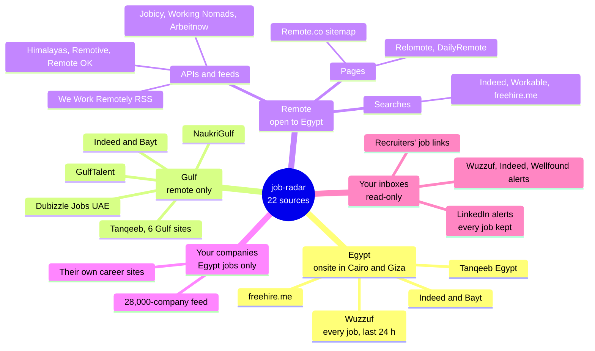
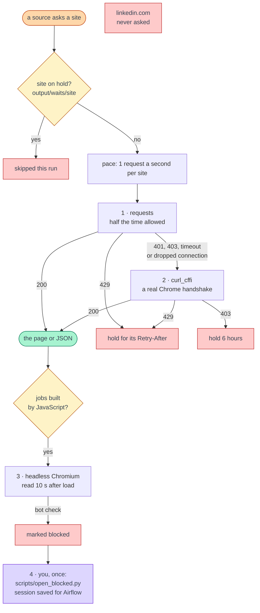

# Architecture

The picture to keep in your head is the scout in the [GUIDE](../GUIDE.md#-the-mental-model): it sweeps,
sifts, merges, ranks, and you act. This page draws the machine behind it, in four pictures, then
says where to change what. How each source is read, with the tests behind each choice, is in
[scraping-plan.md](scraping-plan.md); your companies and their Egypt jobs pages are in
[companies.md](companies.md).

## Two ways to run it

Docker and Airflow run on their own once a day. Claude Code runs with you, by hand, when you type
`/job-radar`: that is where your own limit pays for what the schedule never gets, and what it
fixes or unlocks (a saved login, a repaired reader) the daily run uses from then on.

```mermaid
%% flowchart: the two ways to run job-radar, and how they feed each other
%% 1 Docker + Airflow on its own once a day | 2 Claude Code + Docker by hand (/job-radar)
flowchart LR
    subgraph auto["Docker + Airflow: on its own, once a day"]
        direction TB
        noon(["12pm Cairo,<br>or your Trigger"]):::trigger --> collect["collect<br>22 sources, one by one"]
        collect --> warehouse[("warehouse<br>core.job")]
        warehouse --> mails(["right after<br>2 emails"]):::success
    end
    subgraph hand["Claude Code + Docker: by hand, /job-radar"]
        direction TB
        you(["you type /job-radar"]):::trigger --> check["check the stack<br>and the blocked sites"]
        check --> unlock["open_blocked.py<br>you pass a check or log in"]:::ai
        check --> repair["scraping skills<br>repair or add a reader"]:::ai
        check --> review["review against your CV,<br>tailor, apply with your yes"]:::ai
    end
    unlock -->|"session saved<br>output/sessions"| collect
    repair -->|"code fix, runs every day"| collect
    warehouse -->|"today's matches"| review

    classDef trigger fill:#fed7aa,stroke:#c2410c,color:#374151
    classDef success fill:#a7f3d0,stroke:#047857,color:#374151
    classDef ai fill:#ddd6fe,stroke:#6d28d9,color:#374151
```

## Where the jobs come from

Grouped by your place rule: in Egypt onsite or hybrid jobs count (Cairo and Giza); everywhere else
only remote jobs.

## One collect

Ten extract tasks run one by one, each within 150 seconds, so a busy laptop is not swamped; a whole
collect takes about 15 minutes, and both emails go right after it. A job first seen over 4 days ago
is deleted with its raw postings, unless you noted or applied to it (`core.job_seen` keeps its key).
Every posting is stored once (its source and link), every job once (`core.job`), every email
sends a job once.

```mermaid
%% flowchart: one collect, left to right
%% clock -> schema -> 10 extract tasks one by one -> raw -> transform -> core -> describe -> match_skills -> export
%% the two email DAGs run once match_skills is done (an Airflow Asset) and read the mart view
flowchart LR
    clock(["Airflow<br>12pm Cairo,<br>or your Trigger"]):::trigger --> schema["schema<br>settings.yaml to core.company"]
    schema --> extracts
    subgraph extracts["10 extract tasks, one by one, 150 s each"]
        direction TB
        boards["extract_boards<br>Indeed"]
        bayt["extract_bayt<br>Bayt"]
        egypt["extract_egypt<br>Wuzzuf, Tanqeeb x7"]
        gulf["extract_gulf<br>NaukriGulf, GulfTalent, Dubizzle"]
        remote["extract_remote<br>10 remote boards"]
        freehire["extract_freehire"]
        workable["extract_workable<br>once a day"]
        companies["extract_companies<br>Egypt jobs only"]
        portals["extract_portals<br>28,000-company feed"]
        inbox["extract_email<br>your inboxes"]
    end
    extracts --> raw[("raw.job_posting<br>each posting once:<br>source + link")]
    raw --> transform["transform<br>roles, places, level<br>one row per job"]
    transform --> core[("core.job")]
    core --> describe["describe<br>descriptions from job pages"]
    describe --> match["match_skills"]
    match --> export["export_career_ops"]
    core -.-> mart[("mart.job_status")]
    mart -.-> emails(["2 emails<br>right after<br>each job once"]):::success

    classDef trigger fill:#fed7aa,stroke:#c2410c,color:#374151
    classDef success fill:#a7f3d0,stroke:#047857,color:#374151
```

## Every request

Limits first, to avoid bans: a site on hold is not asked, and every site gets at most one request a
second. A site that refuses climbs the ladder; the code never solves a check and never logs in.

## Where to change what

| You want to | Change | What happens |
|---|---|---|
| a role, a place, your level, the schedule | `settings.yaml` | the next run uses it; a schedule change shows in Airflow within a minute |
| add or remove a company, or its Egypt jobs page | `settings.yaml` (companies), then `.venv\Scripts\python scripts\companies_doc.py` rewrites [companies.md](companies.md) | the schema step copies the list to `core.company`; a changed link is detected again |
| an inbox, an app password, Gmail | `.env` | `docker compose up -d` (the containers read `.env` when they start) |
| a site that shows a bot check or needs a login | run `scripts/open_blocked.py` (or `/job-radar` starts it) | your session is saved in `output/sessions/` and used by the next run |
| add a job source | a function in the module of its group in `job_radar/sources/` (`egypt.py`, `gulf.py`, `remote.py`, `boards.py`, `companies.py`, `inbox.py`) that asks through `get()` / `fetch()` from `base.py` and returns `row(...)` rows; add it to an `extract_*` step in `job_radar/steps.py` (a new step also goes in `__main__.py` STEPS and `dags/job_radar.py`) | a saved sample in `tests/fixtures/` and a test in `tests/test_sources.py`; a row in [scraping-plan.md](scraping-plan.md) |
| how fast one site is asked | `GAP` in `job_radar/sources/base.py` | 1 second unless named there |
| the email's look | `job_radar/digest.py` | the next email |
| a table or a view | `sql/schema.sql` | applied at the start of every collect |
| the tracker | `tracker/app.py` | refresh the page |

Before a change goes in: `.venv\Scripts\python -m pytest tests` (24 tests, no network, about 10 seconds): the rate limits,
every reader against a saved sample of its site, and `companies.md` against `settings.yaml`.
